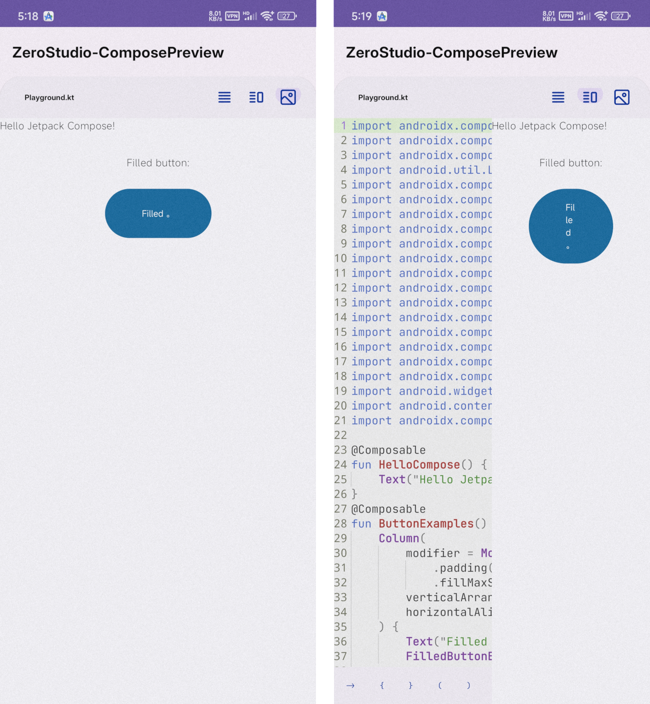

Faster and lighter ZeroStudio Comparatively Preview


## Project introduction:
 As shown in the view example, it demonstrates how to visually preview the sdk dependent layout of the androidx.compose series on an Android phone.


tip：There are videos available for viewing


Regarding development: This project is developed using [ZeroStudio](https://github.com/msmt2018/ZeroStudio)

Customize Compose Preview Best Practices for ZeroStudio


Please note: If you need to reference code snippets from this project or develop your own project using this project, please indicate the source.

## License

```
## 📜 License & Legal Terms (许可与法律条款)


**ZeroStudio** is released under the **ZeroStudio Community License v1.0 (ZSCL)**.
This is a **Source-Available** license based on GNU GPLv3 but with **strict Mandatory Additional Terms** that take precedence.

> 🛑 **CRITICAL WARNING / 重要警示**
>
> This is **NOT** a standard GPLv3 project. The "Additional Terms" strictly **PROHIBIT** any form of commercial usage, monetization, or closed-source distribution.
>
> 本项目**不是**标准的 GPLv3 项目。附加条款**严禁**任何形式的商业使用、变现或闭源分发。

### 🚫 Prohibited Actions (绝对禁止行为) 
：：PS：Prohibited behavior: As the name suggests, it refers to behavior that is not advocated, unusable, harmful to the interests of others, and has a significant impact.Regardless of the protocol/open source protocol of this project, as long as this project is not deleted, it has the root retention, branching, or change. Any malicious, prohibited, or illegal behavior caused by individuals shall be borne by themselves.
2.法律安全范围内危险/违规行为，除了违法/违规等红线行为：必须获得开发者认可或者授权，在github问题反馈或者讨论区创建你的申请需求书。
3.在ZeroStudio增加收费：除了github和其它捐赠平台等捐助外，如果是需要在ZeroStudio内增加收费功能，需获得开发者认可或者授权，不得私自增加收费功能到ZeroStudio的apk内，需获得认可授权。
en：
2. Dangerous/illegal activities within the bounds of legality, excluding illegal/violation-of-law-regulation behaviors: Developer approval or authorization is required. Create your application request in the GitHub issue feedback or discussion forum.
3. Adding paid features to ZeroStudio: Besides donations through GitHub and other donation platforms, adding paid features to ZeroStudio requires developer approval or authorization. Adding paid features to the ZeroStudio APK without authorization is prohibited.

Under this license, the following actions are **STRICTLY PROHIBITED** and will result in immediate termination of rights and potential legal action:

2.  **No Access Restrictions (严禁访问限制):**
    *   To ensure user experience, I strongly do not recommend adding advertisements, especially those that greatly affect the use of the drinking client operation
    *   It is prohibited to add any illegal/criminal content and code within the source code, such as virtual currency, pornography, illegal intrusion/modification of devices, using high-risk permissions to write code that harms the interests/devices of others, fraud, phishing, and other Trojan behaviors. Any illegal behavior of backdoors is also prohibited

### ✅ User Freedoms (用户权利)

*   **Free to Use:** You may use this software for personal, educational, or internal non-profit purposes freely.
*   **Free to Modify:** You may modify the code, provided you keep it **100% Open Source**.
---

<details open>
<summary><strong>⚖️ Detailed Legal Constraints (详细法律约束与免责)</strong></summary>

### 1. Transparency Requirement (透明化要求)
Any fork, derivative work, or modification of ZeroStudio **MUST be 100% Open Source**.
*   **No Closed Source:** You are prohibited from releasing modified versions under closed-source or proprietary licenses.
*   **Attribution:** You must retain the original author attribution (`@author android_zero` and contributors) in all source files.

### 2. null

### 3. Usage Responsibility (使用责任)
*   **Malware Prohibition:** It is strictly forbidden to use this IDE to create malicious software (Viruses, Trojans, Spyware) or software that intentionally damages user hardware.
*   **Disclaimer:** The ZeroStudio team is not responsible for any applications created by third-party developers using this IDE.

### 4. About the License (关于协议)
This project operates under the **ZeroStudio Community License (ZSCL)**.
*   While based on GPLv3, the **Section 7 Additional Terms** (prohibiting commercial use) are **MANDATORY** and **IRREVOCABLE**.
*   Any attempt to remove these restrictions using GPLv3 Section 7 loopholes is expressly voided by the Supremacy Clause of ZSCL.

**[📄 Click here to view the full LICENSE file](./LICENSE)**

</details>

```

Any violations to the license can be reported either by opening an issue or writing a mail to us
directly.


